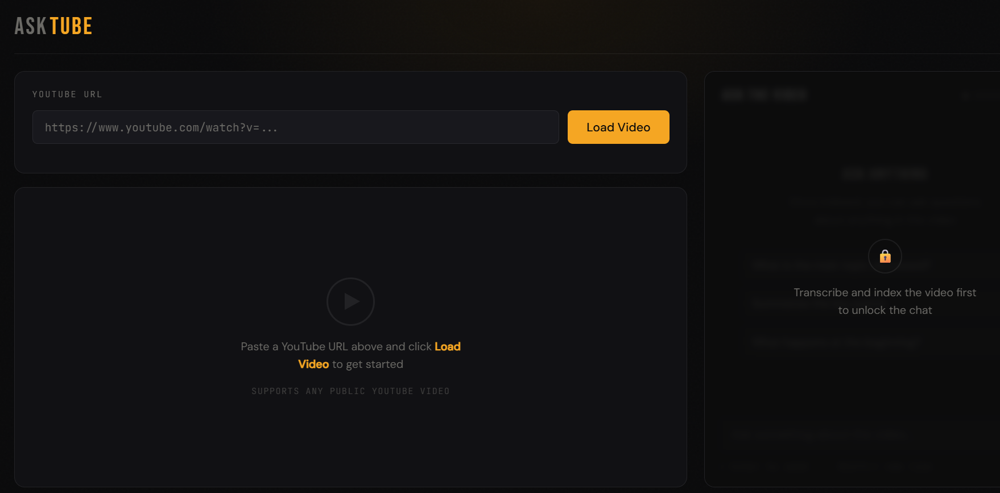
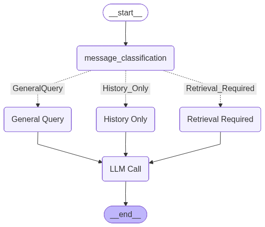

<div align="center">

# 🎬 AskTube

### Chat with any YouTube video using AI

[](https://python.org)
[](https://fastapi.tiangolo.com)
[](https://docker.com)
[](https://github.com/langchain-ai/langgraph)
[](https://www.trychroma.com)
[](https://redis.io)
[](https://github.com/openai/whisper)
[](LICENSE)

Paste a YouTube link → AskTube downloads it, transcribes it with Whisper, indexes it in ChromaDB,<br>
and lets you **chat with the video** through a LangGraph agent — with OCR on the frames it cites.

</div>

---

## 📽️ Demo Video

<div align="center">

<!-- TODO: replace YOUTUBE_VIDEO_ID with the ID of the demo video (the part after watch?v=) -->
<a href="https://youtu.be/ZFn1x7jbxeI">
  
</a>

**[▶ Watch the demo on YouTube](https://youtu.be/ZFn1x7jbxeI)**

</div>

---

## 📑 Table of Contents

- [How It Works](#-how-it-works)
- [LangGraph Agent](#-langgraph-agent)
- [Features](#-features)
- [Tech Stack](#-tech-stack)
- [Getting Started (Docker)](#-getting-started-docker)
- [Local Setup (without Docker)](#-local-setup-without-docker)
- [Configuration](#%EF%B8%8F-configuration)
- [API Reference](#-api-reference)
- [Project Structure](#%EF%B8%8F-project-structure)
- [Troubleshooting](#%EF%B8%8F-troubleshooting)
- [License](#-license)

---

## 🧠 How It Works

```
   YouTube URL
        │
        ▼
┌──────────────────┐
│      yt-dlp      │  downloads video.mp4
└────────┬─────────┘
         ▼
┌──────────────────┐
│      ffmpeg      │  extracts 16 kHz mono audio.wav
└────────┬─────────┘
         ▼
┌──────────────────┐
│  OpenAI Whisper  │  transcribes → timestamped segments (transcript.jsonl)
└────────┬─────────┘
         ▼
┌──────────────────┐
│     ChromaDB     │  embeds & indexes each segment with start/end metadata
└────────┬─────────┘
         ▼
┌──────────────────┐     ┌──────────────────────────────────────────┐
│ LangGraph Agent  │◄───►│ Redis — checkpoints chat state per job   │
└────────┬─────────┘     └──────────────────────────────────────────┘
         │  on retrieval: grabs the frame at each matched timestamp
         │  and runs Tesseract OCR to capture on-screen text
         ▼
   WebSocket chat  ── answers in the browser, next to the video player
```

---

## 🤖 LangGraph Agent

Every message first goes through a router that decides how much context the answer needs:

<div align="center">
  
</div>

| Route | Trigger | Behaviour |
|-------|---------|-----------|
| `General` | Casual or off-topic questions | Answers directly, no retrieval |
| `History_Only` | Follow-ups about earlier messages | Answers from chat + knowledge history |
| `Retrieval_Required` | Questions about the video | Queries ChromaDB (top 7 segments), OCRs the matching frames, then answers |

All routes end at the `LLM Call` node (`gpt-4o-mini`). Graph state is checkpointed in Redis under the job ID, so conversation context survives WebSocket reconnects.

---

## ✨ Features

- **One-click ingestion** — paste a URL; download and audio extraction run automatically
- **In-browser playback** — watch the video alongside the conversation
- **Real-time chat over WebSockets** — no page reloads
- **Timestamped retrieval** — transcript chunks carry start/end times
- **Visual context** — OCR on the frames behind each retrieved chunk (slides, code, diagrams)
- **Routing agent** — avoids retrieval when the question doesn't need it
- **Persistent per-job vector store** — re-query without re-indexing
- **Redis checkpointing** — chat history survives reconnects
- **Dockerized** — GPU-accelerated Whisper, falls back to CPU automatically

---

## 🧰 Tech Stack

| Layer | Tools |
|-------|-------|
| API / server | FastAPI, Uvicorn, WebSockets |
| Agent | LangGraph, `langgraph-checkpoint-redis`, OpenAI `gpt-4o-mini` |
| Speech-to-text | OpenAI Whisper (PyTorch, CUDA) |
| Retrieval | ChromaDB (default ONNX MiniLM embeddings) |
| Media | yt-dlp, ffmpeg, Tesseract OCR |
| Frontend | Single-file HTML/CSS/JS (`frontend2.html`) |

---

## 🚀 Getting Started (Docker)

AskTube runs as **two containers**: the official Redis image and the AskTube app.

### Prerequisites

- [Docker Desktop](https://www.docker.com/products/docker-desktop/) (includes Docker Compose)
- An [OpenAI API key](https://platform.openai.com/api-keys)
- *Optional:* an NVIDIA GPU + recent driver for fast transcription. On Windows, Docker Desktop's WSL 2 backend exposes the GPU automatically; on Linux install the [NVIDIA Container Toolkit](https://docs.nvidia.com/datacenter/cloud-native/container-toolkit/latest/install-guide.html).

### 1. Clone the repository

```bash
git clone https://github.com/tushar-81/AskTube.git
cd AskTube
```

### 2. Create a `.env` file

```env
OPENAI_API_KEY=sk-...
```

### 3. Start Redis

```bash
docker run -d --name redis-cache -p 6379:6379 redis
```

> Redis 8+ is required — the LangGraph checkpointer uses the built-in JSON and Search modules.
> Already created it before? Just run `docker start redis-cache`.

### 4. Build and start AskTube

```bash
docker compose up --build -d
```

The first build downloads PyTorch with CUDA (~3 GB), so it takes a while. The first transcription also downloads the Whisper model, which is cached in the `model-cache` volume.

### 5. Open the app

```
http://localhost:8000
```

Check both containers are up with `docker ps` — you should see `redis-cache` and `asktube-app`.

<details>
<summary><b>Running without a GPU</b></summary>

Remove the `deploy:` block from `docker-compose.yml`, then run `docker compose up --build -d`. Whisper runs on CPU — slower, but it works.

</details>

<details>
<summary><b>Running without Docker Compose</b></summary>

```bash
docker build -t asktube .

docker run -d --name asktube-app --gpus all -p 8000:8000 \
  --env-file .env \
  -e REDIS_HOST=host.docker.internal \
  --add-host host.docker.internal:host-gateway \
  -v "$(pwd)/upload_videos:/app/upload_videos" \
  -v asktube-models:/root/.cache \
  asktube
```

Leave out `--gpus all` to run on CPU.

</details>

<details>
<summary><b>Useful commands</b></summary>

```bash
docker compose logs -f app   # follow app logs
docker compose down          # stop the app (Redis keeps running)
docker stop redis-cache      # stop Redis
```

</details>

---

## 💻 Local Setup (without Docker)

You need Python 3.10+, **ffmpeg** and **Tesseract OCR** installed and on your system.

```bash
python -m venv .venv
source .venv/bin/activate          # Windows: .venv\Scripts\activate

# 1. PyTorch — pick the wheel for your CUDA version at https://pytorch.org/get-started/locally/
pip install torch --index-url https://download.pytorch.org/whl/cu126

# 2. Everything else
pip install -r requirements.txt

# 3. Redis (still via Docker)
docker run -d --name redis-cache -p 6379:6379 redis

# 4. Run
uvicorn main:app --host 0.0.0.0 --port 8000 --reload
```

> **Windows:** if ffmpeg or Tesseract aren't on `PATH`, AskTube looks in `C:/ffmpeg/bin` and `C:\Program Files\Tesseract-OCR\tesseract.exe`. Override with `FFMPEG_LOCATION` / `TESSERACT_CMD`.

---

## ⚙️ Configuration

All settings are environment variables (put them in `.env` or in `docker-compose.yml`).

| Variable | Description | Default |
|----------|-------------|---------|
| `OPENAI_API_KEY` | OpenAI API key (router + answering LLM) | **required** |
| `WHISPER_MODEL` | `tiny`, `base`, `small`, `medium`, `large`, `turbo` | `base` |
| `REDIS_HOST` | Redis hostname | `localhost` (`host.docker.internal` in Compose) |
| `REDIS_PORT` | Redis port | `6379` |
| `UPLOAD_DIR` | Where videos, audio, transcripts and ChromaDB are stored | `upload_videos` |
| `FFMPEG_LOCATION` | Folder containing ffmpeg, if not on `PATH` | `C:/ffmpeg/bin` on Windows |
| `TESSERACT_CMD` | Path to the tesseract binary, if not on `PATH` | Default install path on Windows |

> `base` fits comfortably in 4 GB of VRAM. Use `small` or `medium` for better accuracy on larger GPUs.

---

## 🔌 API Reference

| Method | Endpoint | Description |
|--------|----------|-------------|
| `GET` | `/` | Serves the frontend |
| `POST` | `/upload-url?url=<yt_url>` | Downloads the video, starts audio extraction, returns `job_id` |
| `GET` | `/status/{job_id}` | Poll audio extraction: `processing` / `ready` / `failed` |
| `POST` | `/upload/{job_id}` | Transcribe → embed → store in ChromaDB |
| `WS` | `/upload/{job_id}/query` | Chat endpoint — send text, receive the answer |
| `DELETE` | `/uploads/{job_id}/delete` | Delete all files for a job |
| `GET` | `/videos/{job_id}/video.mp4` | Stream the downloaded video |

Interactive docs are available at `http://localhost:8000/docs`.

---

## 🗂️ Project Structure

```
AskTube/
├── graph/
│   ├── graph_nodes.py      # LangGraph nodes, router & Redis checkpointer
│   ├── LLM_call.py         # OpenAI chat / JSON-mode calls
│   └── state.py            # AgentState TypedDict
├── architecture/           # README images
├── static/                 # Static assets served at /static
├── upload_videos/          # Per-job runtime data (gitignored)
│
├── main.py                 # FastAPI app — routes & WebSocket endpoint
├── app.py                  # YouTube download & audio extraction
├── store_in_DB.py          # ChromaDB ingestion, querying & OCR orchestration
├── OCR.py                  # Frame capture + Tesseract OCR
├── frontend2.html          # Single-file UI (video player + chat)
│
├── Dockerfile
├── docker-compose.yml
├── requirements.txt
└── .env                    # API keys (never commit this)
```

---

## 🛠️ Troubleshooting

<details>
<summary><b>Video fails to download</b></summary>

- Make sure the video is public and not age-restricted.
- YouTube changes often — rebuild with a newer `yt-dlp` pinned in `requirements.txt`.

</details>

<details>
<summary><b>Chat doesn't remember earlier messages / WebSocket closes right away</b></summary>

- Check Redis is running: `docker ps` should list `redis-cache`. If not: `docker start redis-cache`.
- Make sure you clicked **Transcribe & Index** (`POST /upload/{job_id}`) first — chat only works after indexing.

</details>

<details>
<summary><b>Transcription is very slow</b></summary>

Whisper is running on CPU. Check the GPU is visible inside the container:

```bash
docker exec asktube-app python -c "import torch; print(torch.cuda.is_available())"
```

</details>

<details>
<summary><b>CUDA out of memory</b></summary>

Use a smaller model: set `WHISPER_MODEL=tiny` or `base`.

</details>

<details>
<summary><b>ChromaDB errors</b></summary>

Delete stale job folders in `upload_videos/` from previous runs and restart.

</details>

---

## 📄 License

MIT License — see [LICENSE](LICENSE) for details.

---

<div align="center">
Built with FastAPI · LangGraph · OpenAI Whisper · ChromaDB · Redis
</div>
